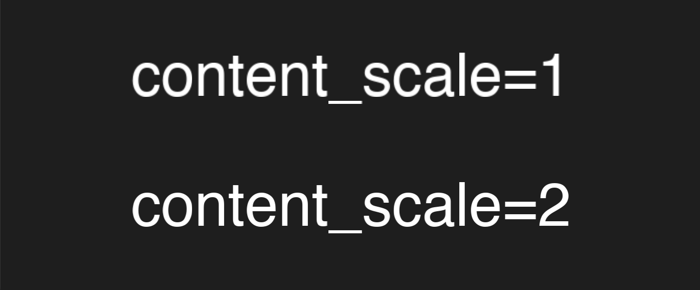

Text Rendering
==============

TachyPy offers multiple text paths depending on precision and dependency needs.

Text class
----------

``Text`` is TachyPy's polished system-font renderer. It is the friendly public
name for ``GLSystemText`` and uses FreeType + HarfBuzz when available, with an
OpenGL bitmap fallback.

OpenGL text renderers
---------------------

- ``GLText``: bitmap glyph renderer in pure OpenGL.
- ``GLTextSDF``: signed-distance-field renderer for smoother scaling.
- ``GLSystemText``: explicit backward-compatible name for ``Text``.
  You can pass a family name, comma-separated fallback list, or a direct
  font-file path.

The OpenGL renderers are backend-independent and do not require
Pillow.

Recommended usage
-----------------

- Use ``Text`` for high-quality instruction screens and overlays.
- Use ``GLSystemText`` only when you want the explicit historical class name.
- Use ``GLTextSDF`` when scalable text quality matters and shaping is simple.
- The old Pillow texture-backed constructor is retained as
  ``tachypy.text.LegacyText`` for compatibility.

HiDPI and Retina displays
--------------------------

On Retina displays the framebuffer has more physical pixels than logical pixels.
Pass ``screen.content_scale`` so FreeType rasterizes at the correct physical
resolution — otherwise text appears blurry.

.. code-block:: python

    label = Text("Hello", content_scale=screen.content_scale)

