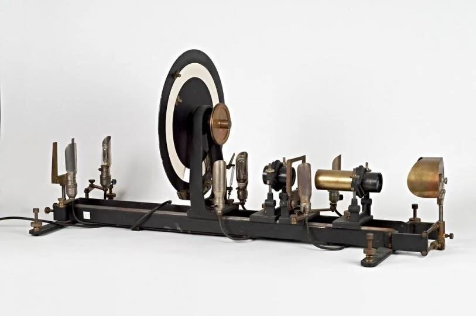
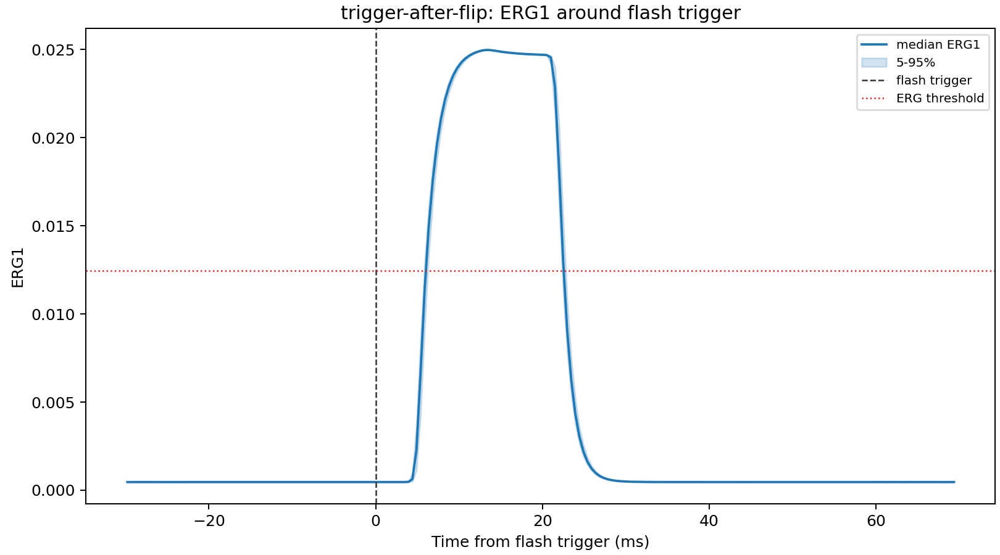

Timing Validation
=================

Why "TachyPy"?
--------------

TachyPy is named after the tachistoscope, a classic laboratory instrument used
to present visual stimuli for precisely controlled, brief durations. The goal of
TachyPy is to provide the same timing discipline for Python psychophysics
experiments while keeping experiment code readable and inspectable.

Photodiode test
---------------

The GLFW backend was tested with a photodiode setup using a centrally presented
white square on a uniform gray background. The white square was shown for one
frame on a 60 Hz monitor. The photodiode was placed at the screen center, over
the white square, and the EEG recording captured both serial trigger events and
the photodiode signal.

The after-flip trigger condition is shown here. The dashed line marks the serial
flash trigger. The blue trace is the median photodiode waveform, with
the shaded region showing the 5th to 95th percentile range across flashes.

Summary for this run:

- Median rise after flash trigger: ``6.35 ms``.
- SD of rise after flash trigger: ``0.20 ms``.
- Median photodiode pulse width: ``16.60 ms``.
- SD of photodiode pulse width: ``0.18 ms``.

Interpretation
--------------

The photodiode is the hardware reference for photon onset at the measured screen
location. TachyPy's software flip timestamps are useful for experiment logs, but
they should be interpreted as display-swap timestamps rather than direct photon
onset measurements. Exact photon timing depends on display scanout, the stimulus
location, panel response, and display electronics.

For timing-critical validation, combine:

- TachyPy flip timestamps.
- Serial trigger timestamps in the acquisition system.
- Photodiode traces at the relevant stimulus location.

Practical implication
---------------------

The first frames after display/context creation can be less stable on real
hardware. TachyPy therefore presents neutral gray warmup frames by default when
``Screen`` is initialized. The warmup can be tuned with ``warmup_frames`` or
disabled with ``warmup_frames=0``.
