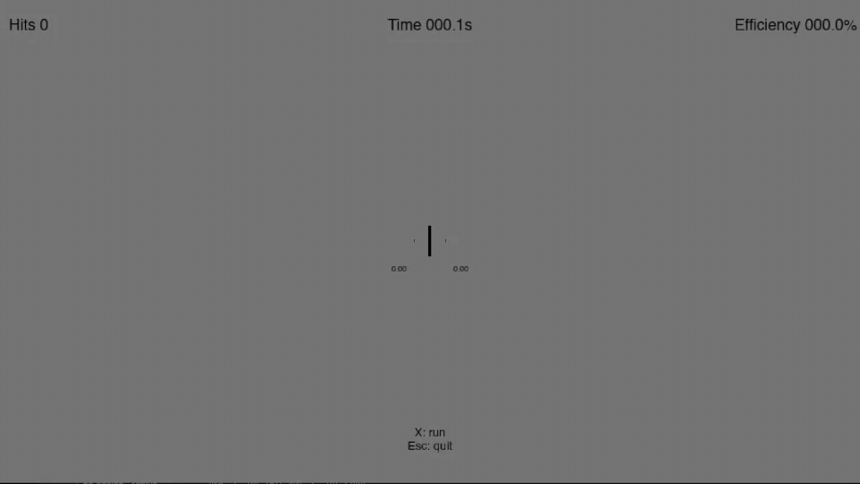
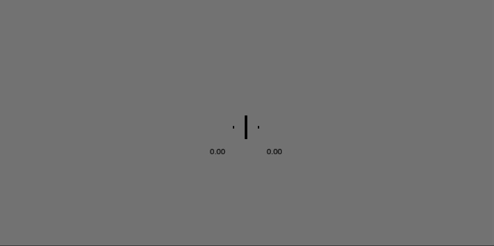

Wooting Analog Keyboards
========================

TachyPy integrates with **TachyWooting**, a hardware toolbox for Wooting analog
keyboards (analog pressure acquisition,
hierarchical HDF5 logging, light-press / release readiness checks). The hardware
toolbox is usable on its own; this page documents only what becomes available
**inside TachyPy** once the integration is installed — on-screen visual pressure
feedback and analog scrollbar responses. For the full keyboard/logging
reference, see TachyWooting's own documentation.

Installation
------------

The integration ships as an optional extra. It pulls ``tachywooting`` and exposes
the keyboard through the top-level ``tachypy`` namespace:

.. code-block:: bash

   pip install "tachypy[wooting]"

(See `First-time setup`_ below for the one-time native/permissions step.)

One import surface
------------------

The enriched ``WOOTING_ACQUISITION`` — the hardware acquisition class plus
TachyPy visual feedback and analog scrollbar interaction — is available straight
from the top-level package:

.. code-block:: python

   from tachypy import WOOTING_ACQUISITION  # keyboard + visual feedback

You never import ``tachywooting`` directly. ``WOOTING_ACQUISITION`` is the only
keyboard symbol exposed at the top level (it is the common entry point and its
name is unambiguous). The rest of the keyboard surface — the helpers
(``convert_char_to_keycode``, ``load_trial``, ``load_session``,
``trial_to_dataframe``, ``visualize``, ``visualize_all_keys``) and the low-level
CFFI handles ``lib`` and ``ffi`` — lives under :mod:`tachypy.wooting`:

.. code-block:: python

   from tachypy.wooting import visualize, load_trial, convert_char_to_keycode

How the enrichment works
------------------------

``WOOTING_ACQUISITION`` is enriched in ``tachypy/wooting/__init__.py``: it is a
thin subclass that combines TachyWooting's hardware acquisition class with two
TachyPy mixins. ``VisualPressureFeedbackMixin`` adds
``wait_light_press_visual`` and ``AnalogSliderMixin`` adds ``interact_slider``:

.. code-block:: python

   from tachywooting import WOOTING_ACQUISITION as _BaseAcquisition
   from tachypy.feedback import VisualPressureFeedbackMixin
   from tachypy.scrollbar_interaction import AnalogSliderMixin

   class WOOTING_ACQUISITION(
       _BaseAcquisition, VisualPressureFeedbackMixin, AnalogSliderMixin
   ):
       """Hardware acquisition plus TachyPy feedback and slider interaction."""

This keeps the hardware package (TachyWooting) completely free of TachyPy — the
TachyPy features are grafted on here, on the integration side. The visual mixin
relies on the :class:`~tachypy.feedback.PressureSource` contract, while the
slider mixin relies on ``read_pressures(keys)`` and optional
``validate_analog_keys(keys)``. The same pattern can enrich another analog
keyboard by subclassing its acquisition class and selecting the applicable
TachyPy mixins.

First-time setup
----------------

The first time you create a ``WOOTING_ACQUISITION``, TachyPy builds the native
interface automatically if it is missing (this needs only a C compiler, no admin
rights). The Wooting **SDK plugins and input permissions**, however, require a
one-time privileged step:

.. code-block:: bash

   wooting-build-interface   # installs SDK plugins + permissions (needs admin)

If the keyboard is not detected, the error message tells you exactly to run this
command — you do not have to remember it.

Basic keyboard use
------------------

The enriched class behaves exactly like the hardware acquisition class for
acquisition and logging:

.. code-block:: python

   from tachypy import WOOTING_ACQUISITION

   acq = WOOTING_ACQUISITION(threshold=0.8)
   acq.initialize_keyboard(verbose=True)
   try:
       # Instantaneous analog pressure (0.0–1.0) of one or more keys
       print(acq.read_pressure("C"))
       print(acq.read_pressures(["C", "Z"]))

       # Block until keys are held in the light-press range (no display needed)
       acq.wait_keys_light_press(target_keys=["C", "Z"], quit_key="Q")

       # Record an analog trial and write it to an HDF5 shard
       acq.setup_logging(name="tracking", path="logs", int_analog=2)
       trial = acq.acquire_analog_values(target_keys=["C", "Z"])
   finally:
       acq.uninitialize_keyboard()

Visual pressure feedback
------------------------

.. note::

   **Why this matters.** The whole point of an analog keyboard is to record the
   *continuous pressure trajectory* of a response, not just a binary press — and
   that only works if the participant's fingers are already resting on the keys
   when the trial begins. Requiring a stable light press before each trial:

   - **guarantees the fingers are on the keys**, so the full movement is captured
     from its earliest, lowest-pressure samples;
   - **guides them to the right resting pressure** — high enough that softer
     presses still fall inside the trackable range, yet low enough to leave
     headroom for the fuller press that follows.

   The on-screen feedback turns this abstract requirement into something the
   participant can simply *aim for*.

``wait_light_press_visual`` shows an interactive fixation cross while waiting for
two keys to stay within the light-press interval for ``hold_seconds``. It needs a
TachyPy :class:`~tachypy.Screen`; pass a :class:`~tachypy.ResponseHandler` to let
the participant quit early:

.. code-block:: python

   from tachypy import Screen, ResponseHandler, FixationCross
   from tachypy import WOOTING_ACQUISITION

   acq = WOOTING_ACQUISITION(threshold=0.8, min_pressure_start=0.33, max_pressure_start=0.66)
   acq.initialize_keyboard()

   screen = Screen(fullscreen=False)
   rh = ResponseHandler(screen=screen)
   fixation = FixationCross(center=(screen.width // 2, screen.height // 2),
                            half_width=18, half_height=18, thickness=8, color=(0, 0, 0))

   ready = acq.wait_light_press_visual(
       target_keys=["c", "z"],
       screen=screen,
       response_handler=rh,
       fixation_cross=fixation,   # geometry + color copied automatically
       show_pressure_text=True,
       show_goal_markers=True,
   )

The horizontal bar grows and shrinks with pressure, turns toward the target color
as the hold completes, and (optionally) shows live pressure values for keys that
fall outside the acceptable interval.

Analog scrollbar responses
--------------------------

The Wooting acquisition provides pressure-controlled responses for any
configured :class:`~tachypy.scrollbar.Scrollbar` through ``interact_slider``.
For normal mouse-only use and visual customization, see :doc:`scrollbar`.

Quick start
~~~~~~~~~~~

Pass a normal TachyPy scrollbar to the enriched Wooting acquisition. The
defaults are ``Z`` to decrease, ``C`` to increase, and ``X`` to confirm:

.. code-block:: python

   from tachypy import Screen, Scrollbar, WOOTING_ACQUISITION

   acq = WOOTING_ACQUISITION()
   acq.initialize_keyboard()
   screen = Screen(fullscreen=False)
   scrollbar = Scrollbar(screen_width=screen.width, screen_height=screen.height,
                         position_y=screen.height / 2,
                         content_scale=screen.content_scale)

   try:
       value, reaction_time = acq.interact_slider(
           slider=scrollbar,
           screen=screen,
       )
   finally:
       acq.uninitialize_keyboard()
       screen.close()

The method returns ``(value, reaction_time)`` on confirmation and
``(None, None)`` when the participant presses ``Escape`` or closes the window.
A default :class:`~tachypy.responses.ResponseHandler` is created automatically.

Controls and pressure mapping
~~~~~~~~~~~~~~~~~~~~~~~~~~~~~

The controls are:

.. list-table:: Default analog controls
   :header-rows: 1
   :widths: 18 28 54

   * - Key
     - Role
     - Behaviour
   * - ``Z``
     - Decrease
     - Moves toward the lower end of the scrollbar. Speed depends on pressure.
   * - ``C``
     - Increase
     - Moves toward the higher end of the scrollbar. Speed depends on pressure.
   * - ``X``
     - Confirm
     - Selects the current value when its pressure crosses the confirmation threshold.

Use any three distinct analog keys by passing ``decrease_key``, ``increase_key``
and ``confirm_key``. TachyPy validates their Wooting analog mappings before the
loop starts and raises if a configured key is unavailable.

.. code-block:: python

   value, reaction_time = acq.interact_slider(
       slider=scrollbar, screen=screen,
       decrease_key="a", increase_key="d", confirm_key="space")

Movement is continuous. For pressure ``p`` above the deadzone ``d``, the
private :func:`~tachypy.scrollbar_interaction._effective_pressure` helper uses:

.. math::

   p_{effective} = \left(\frac{p - d}{1 - d}\right)^\gamma

Pressures at or below ``d`` produce zero movement; the normalized result is
raised to ``pressure_gamma`` and converted to a proportion of
``movement_speed``. ``gamma=1`` is linear after the deadzone, ``gamma>1`` gives
gentler fine control, and ``0<gamma<1`` is more responsive. ``gamma=0`` is an
on/off step and is rejected. The default is ``pressure_gamma=2.5``.

``X`` cannot confirm while ``Z`` or ``C`` is active. Confirmation is
edge-triggered, and all three keys must be released below ``release_threshold``
before the next trial is armed.

Input modes and customization
~~~~~~~~~~~~~~~~~~~~~~~~~~~~~

The default ``input_mode="keyboard"`` uses analog ``Z``/``C`` movement and
``X`` confirmation. Use ``input_mode="mouse_keyboard"`` to allow both mouse
and analog-key movement, with either a mouse click or ``X`` for confirmation:

.. code-block:: python

   value, reaction_time = acq.interact_slider(
       slider=scrollbar,
       screen=screen,
       input_mode="mouse_keyboard",
       confirm_key="x",
   )

The cursor is hidden and recentered at screen edges. A left click or ``X``
confirms after ``mouse_quiet_period`` seconds without mouse movement. Pressure
on any analog key temporarily gives the keyboard exclusive control. ``X``
must be released and pressed again if it was held during mouse movement.

The interaction loop does not recreate the scrollbar, so all of its visual
customization remains available. Pass ``drawables`` for instruction text or
other TachyPy objects, and tune ``initial_value``, ``movement_speed``,
``pressure_deadzone``, and ``pressure_gamma`` as needed.

Demo and API
~~~~~~~~~~~~~~~~~~~~~

Try the three-trial demo with:

.. code-block:: bash

   tachypy-wooting-slider-demo

The complete API, including the keyboard-agnostic
:func:`~tachypy.scrollbar_interaction.run_slider_interaction`, is documented in
:mod:`tachypy.scrollbar_interaction`.

Logging and a full experiment loop
----------------------------------

Acquisition trials are logged to **HDF5**. Logging is opt-in and follows a simple
lifecycle:

#. ``setup_logging(name, path, int_analog)`` enables logging. ``int_analog=2``
   stores analog pressure in ``[0, 1]``; ``int_analog=1`` stores integer values
   in ``[0, 255]``.
#. Every :meth:`acquire_analog_values` call writes **one trial shard** to a
   staging directory, so a crash mid-experiment never loses completed trials.
#. ``uninitialize_keyboard()`` merges all shards into the final ``<name>.hdf5``
   and releases the SDK. **Always call it at the end** (a ``try/finally`` is the
   safest pattern).

Each ``values`` dataset stores three columns — ``position``, ``time_from_onset``
and ``time_abs`` — under a per-trial, per-key hierarchy::

    /trials/0001/keys/0004/values

Beyond the three columns, **each trial also carries metadata** as HDF5 group
attributes, surfaced under the ``"_attrs"`` key by :func:`load_trial`:

.. list-table::
   :header-rows: 1
   :widths: 24 12 64

   * - Attribute
     - Type
     - Meaning
   * - ``backend``
     - str
     - Readout backend used for the trial (``"read_analog"`` or ``"read_full_buffer"``).
   * - ``threshold``
     - float
     - Actuation threshold (0–1) that defined the response on this trial.
   * - ``threshold_time``
     - float
     - Seconds from ``trial_start_ns`` (onset) to the threshold crossing.
   * - ``threshold_key``
     - int
     - HID keycode of the key that crossed the threshold first.
   * - ``trial_start_perf_ns``
     - int
     - Onset reference timestamp (``perf_counter_ns``) used to compute ``time_from_onset``.
   * - ``trial_start_clock``
     - str
     - Clock the onset was supplied on (``"perf"`` or ``"mono"``).

The threshold-related attributes (``threshold_time``, ``threshold_key``) are
absent when the threshold was never reached during the trial.

A minimal but complete experiment that ties the lifecycle together:

.. code-block:: python

   from tachypy import FixationCross, ResponseHandler, Screen, WOOTING_ACQUISITION
   from tachypy.wooting import convert_char_to_keycode

   YES, NO = "z", "c"

   acq = WOOTING_ACQUISITION(threshold=0.8, min_pressure_start=0.33, max_pressure_start=0.66)
   acq.initialize_keyboard()                       # builds the native interface on first use
   acq.setup_logging(name="participant_01", path="logs", int_analog=2)

   screen = Screen(fullscreen=False)
   rh = ResponseHandler(screen=screen)
   fixation = FixationCross(center=(screen.width // 2, screen.height // 2),
                            half_width=18, half_height=18, thickness=8, color=(0, 0, 0))

   try:
       for trial in range(1, 21):
           # 1) readiness: wait for both fingers to rest lightly on the keys
           if not acq.wait_light_press_visual([YES, NO], screen=screen,
                                              response_handler=rh, fixation_cross=fixation):
               break                               # participant pressed a quit key (Esc, etc.)

           # 2) present your stimulus, then time-lock the trial to the flip
           screen.fill((128, 128, 128))
           # ... draw your stimulus here ...
           onset = screen.flip()                   # flip() returns the post-swap timestamp = onset

           # 3) acquire the response trajectory (writes one HDF5 shard)
           hier = acq.acquire_analog_values([YES, NO], trial_start_ns=onset, trial_start_clock="mono")
           response = acq.get_response_key(hier, [YES, NO])
           print(f"trial {trial}: response = {convert_char_to_keycode([response])[0]}")

   finally:
       acq.uninitialize_keyboard()                 # merges shards -> logs/participant_01.hdf5
       screen.close()

The trial is time-locked through the flip: ``screen.flip()`` returns the post-swap
timestamp on TachyPy's monotonic clock, which is passed straight to
``acquire_analog_values`` as ``trial_start_ns`` with ``trial_start_clock="mono"``.
Every sample's ``time_from_onset`` is then measured from that exact onset.

Reading the log back afterwards needs no keyboard:

.. code-block:: python

   from tachypy.wooting import load_session, load_trial, trial_to_dataframe

   session = load_session("logs/participant_01.hdf5")   # every trial
   trial = load_trial("logs/participant_01.hdf5", 1)     # one trial
   df = trial_to_dataframe(trial)                        # tidy pandas DataFrame

   trial["0006"]["position"]            # per-key trajectory (keycode "0006")
   trial["_attrs"]["threshold_time"]    # trial metadata (see the table above)

Detecting finger removal
------------------------

For the trajectory to be meaningful, the participant must keep their fingers on
the keys *throughout* the trial. Lifting a finger mid-response breaks the
continuous signal the analog keyboard is meant to capture — it is the in-trial
counterpart to the pre-trial readiness check above. After each
:meth:`acquire_analog_values`, the acquisition object reports whether a removal
occurred, so you can warn the participant before it becomes a habit:

.. code-block:: python

   acq.acquire_analog_values([YES, NO], trial_start_ns=onset)

   if acq.reached_consecutive_removal_limit(2):
       # show your own on-screen message (e.g. a TachyPy Text)
       warn(f"Keep your fingers on the keys — lifted {acq.current_removal_streak} trials in a row.")
   elif acq.last_trial_had_removal:
       warn("Try to keep your fingers resting on the keys.")

Related counters let you monitor data quality across the whole session:
``last_trial_had_removal``, ``current_removal_streak``,
``reached_consecutive_removal_limit(n)``, ``removal_trials``, and
``removal_trial_proportion`` (the fraction of trials with at least one removal).
Logging these alongside your responses makes it easy to flag or exclude
compromised trials during analysis.

Custom widgets (advanced)
-------------------------

``wait_light_press_visual`` builds an
:class:`~tachypy.feedback.InteractiveFixationCross` by default. To render feedback
differently, subclass :class:`~tachypy.feedback.PressureFeedbackWidget` and pass it
via ``widget=``. The settings (:class:`~tachypy.feedback.PressureFeedbackConfig`,
which also computes the pressure-to-scale mapping via ``scale_for()``) and the
pressure state machine (:class:`~tachypy.feedback.PressureFeedbackState`) are
reusable building blocks. See :doc:`api` for the full ``tachypy.feedback`` reference.

These tools are keyboard-agnostic: any object exposing the
:class:`~tachypy.feedback.PressureSource` contract (``read_pressures`` plus the
light-press thresholds) can drive the same feedback loop.

Console demos
-------------

The integration installs two on-screen demos (they require a display):

.. code-block:: bash

   tachypy-wooting-fixation-demo   # gamified interactive fixation cross
   tachypy-wooting-mini-bw         # minimal black/white response experiment

