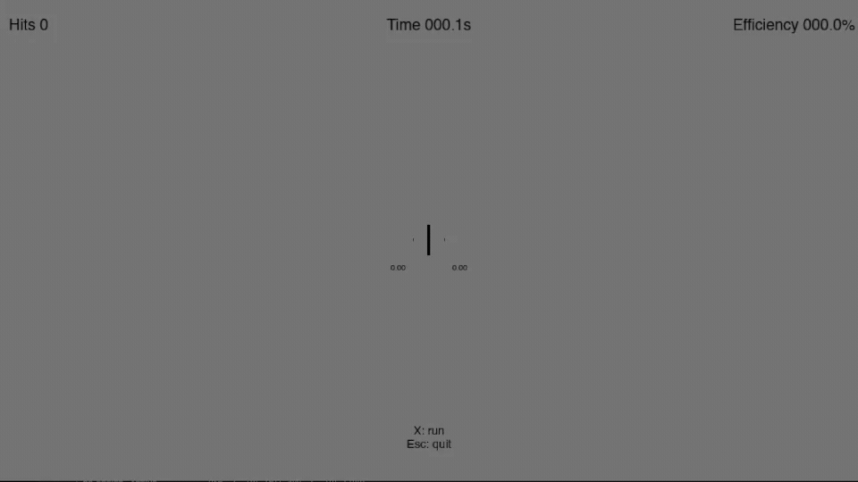
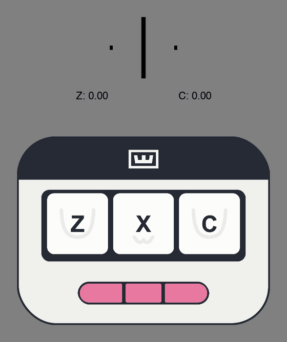
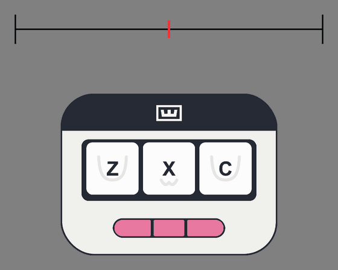
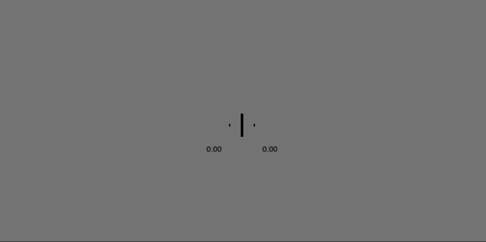

Wooting Analog Keyboards
========================

TachyPy integrates with **TachyWooting**, a hardware toolbox for Wooting analog
keyboards (analog pressure acquisition,
hierarchical HDF5 logging, light-press / release readiness checks). The hardware
toolbox is usable on its own; this page documents only what becomes available
**inside TachyPy** once the integration is installed — on-screen visual pressure
feedback and analog scrollbar responses. For the full keyboard/logging
reference, see TachyWooting's own documentation.

Installation
------------

The integration ships as an optional extra. It pulls ``tachywooting`` and exposes
the keyboard through the top-level ``tachypy`` namespace:

.. code-block:: bash

   pip install "tachypy[wooting]"

(See `First-time setup`_ below for the one-time native/permissions step.)

One import surface
------------------

The enriched ``WOOTING_ACQUISITION`` — the hardware acquisition class plus
TachyPy visual feedback and analog scrollbar interaction — is available straight
from the top-level package:

.. code-block:: python

   from tachypy import WOOTING_ACQUISITION  # keyboard + visual feedback

You never import ``tachywooting`` directly. ``WOOTING_ACQUISITION`` is the only
keyboard symbol exposed at the top level (it is the common entry point and its
name is unambiguous). The rest of the keyboard surface — the helpers
(``convert_char_to_keycode``, ``load_trial``, ``load_session``,
``trial_to_dataframe``, ``visualize``, ``visualize_all_keys``) and the low-level
CFFI handles ``lib`` and ``ffi`` — lives under :mod:`tachypy.wooting`:

.. code-block:: python

   from tachypy.wooting import visualize, load_trial, convert_char_to_keycode

How the enrichment works
------------------------

``WOOTING_ACQUISITION`` is enriched in ``tachypy/wooting/__init__.py``: it is a
thin subclass that combines TachyWooting's hardware acquisition class with two
TachyPy mixins. ``VisualPressureFeedbackMixin`` adds
``wait_light_press_visual`` and ``AnalogSliderMixin`` adds ``interact_slider``:

.. code-block:: python

   from tachywooting import WOOTING_ACQUISITION as _BaseAcquisition
   from tachypy.feedback import VisualPressureFeedbackMixin
   from tachypy.scrollbar_interaction import AnalogSliderMixin

   class WOOTING_ACQUISITION(
       _BaseAcquisition, VisualPressureFeedbackMixin, AnalogSliderMixin
   ):
       """Hardware acquisition plus TachyPy feedback and slider interaction."""

This keeps the hardware package (TachyWooting) completely free of TachyPy — the
TachyPy features are grafted on here, on the integration side. The visual mixin
relies on the :class:`~tachypy.feedback.PressureSource` contract, while the
slider mixin relies on ``read_pressures(keys)`` and optional
``validate_analog_keys(keys)``. The same pattern can enrich another analog
keyboard by subclassing its acquisition class and selecting the applicable
TachyPy mixins.

First-time setup
----------------

The first time you create a ``WOOTING_ACQUISITION``, TachyPy builds the native
interface automatically if it is missing (this needs only a C compiler, no admin
rights). The Wooting **SDK plugins and input permissions**, however, require a
one-time privileged step:

.. code-block:: bash

   wooting-build-interface   # installs SDK plugins + permissions (needs admin)

If the keyboard is not detected, the error message tells you exactly to run this
command — you do not have to remember it.

Basic keyboard use
------------------

The enriched class behaves exactly like the hardware acquisition class for
acquisition and logging:

.. code-block:: python

   from tachypy import WOOTING_ACQUISITION

   acq = WOOTING_ACQUISITION(threshold=0.8)
   acq.initialize_keyboard(verbose=True)
   try:
       # Instantaneous analog pressure (0.0–1.0) of one or more keys
       print(acq.read_pressure("C"))
       print(acq.read_pressures(["C", "Z"]))

       # Block until keys are held in the light-press range (no display needed)
       acq.wait_keys_light_press(target_keys=["C", "Z"], quit_key="Q")

       # Record an analog trial and write it to an HDF5 shard
       acq.setup_logging(name="tracking", path="logs", int_analog=2)
       trial = acq.acquire_analog_values(target_keys=["C", "Z"])
   finally:
       acq.uninitialize_keyboard()

Visual pressure feedback
------------------------

.. note::

   **Why this matters.** The whole point of an analog keyboard is to record the
   *continuous pressure trajectory* of a response, not just a binary press — and
   that only works if the participant's fingers are already resting on the keys
   when the trial begins. Requiring a stable light press before each trial:

   - **guarantees the fingers are on the keys**, so the full movement is captured
     from its earliest, lowest-pressure samples;
   - **guides them to the right resting pressure** — high enough that softer
     presses still fall inside the trackable range, yet low enough to leave
     headroom for the fuller press that follows.

   The on-screen feedback turns this abstract requirement into something the
   participant can simply *aim for*.

``wait_light_press_visual`` shows an interactive fixation cross while waiting for
two keys to stay within the light-press interval for ``hold_seconds``. It needs a
TachyPy :class:`~tachypy.Screen`; pass a :class:`~tachypy.ResponseHandler` to let
the participant quit early:

.. code-block:: python

   from tachypy import Screen, ResponseHandler, FixationCross
   from tachypy import WOOTING_ACQUISITION

   acq = WOOTING_ACQUISITION(threshold=0.8, min_pressure_start=0.33, max_pressure_start=0.66)
   acq.initialize_keyboard()

   screen = Screen(fullscreen=False)
   rh = ResponseHandler(screen=screen)
   fixation = FixationCross(center=(screen.width // 2, screen.height // 2),
                            half_width=18, half_height=18, thickness=8, color=(0, 0, 0))

   ready = acq.wait_light_press_visual(
       target_keys=["c", "z"],
       screen=screen,
       response_handler=rh,
       fixation_cross=fixation,   # geometry + color copied automatically
       show_pressure_text=True,
       show_goal_markers=True,
   )

The horizontal bar grows and shrinks with pressure, turns toward the target color
as the hold completes, and (optionally) shows live pressure values for keys that
fall outside the acceptable interval.

Analog scrollbar responses
--------------------------

The Wooting acquisition provides pressure-controlled responses for any
configured :class:`~tachypy.scrollbar.Scrollbar` through ``interact_slider``.
For normal mouse-only use and visual customization, see :doc:`scrollbar`.

Quick start
~~~~~~~~~~~

Pass a normal TachyPy scrollbar to the enriched Wooting acquisition. The
defaults are ``Z`` to decrease, ``C`` to increase, and ``X`` to confirm:

.. code-block:: python

   from tachypy import Screen, Scrollbar, WOOTING_ACQUISITION

   acq = WOOTING_ACQUISITION()
   acq.initialize_keyboard()
   screen = Screen(fullscreen=False)
   scrollbar = Scrollbar(screen_width=screen.width, screen_height=screen.height,
                         position_y=screen.height / 2,
                         content_scale=screen.content_scale)

   try:
       value, reaction_time = acq.interact_slider(
           slider=scrollbar,
           screen=screen,
       )
   finally:
       acq.uninitialize_keyboard()
       screen.close()

The method returns ``(value, reaction_time)`` on confirmation and
``(None, None)`` when the participant presses ``Escape`` or closes the window.
A default :class:`~tachypy.responses.ResponseHandler` is created automatically.

Controls and movement
~~~~~~~~~~~~~~~~~~~~~

The controls are:

.. list-table:: Default analog controls
   :header-rows: 1
   :widths: 18 28 54

   * - Key
     - Role
     - Behaviour
   * - ``Z``
     - Decrease
     - Moves toward the lower end and accelerates while held.
   * - ``C``
     - Increase
     - Moves toward the higher end and accelerates while held.
   * - ``X``
     - Confirm
     - Selects the current value when its pressure crosses the confirmation threshold.

Use any three distinct analog keys by passing ``decrease_key``, ``increase_key``
and ``confirm_key``. TachyPy validates their Wooting analog mappings before the
loop starts and raises if a configured key is unavailable.

.. code-block:: python

   value, reaction_time = acq.interact_slider(
       slider=scrollbar, screen=screen,
       decrease_key="a", increase_key="d", confirm_key="space")

Pressure only determines whether a movement key is active. Once it exceeds
``pressure_deadzone``, speed increases with hold duration:

.. math::

   speed = movement\_speed \times
   \max\left(0, curve\_y + (1 - curve\_y)
   \min\left(\frac{acceleration \times hold\_duration}{movement\_speed}
   - curve\_x, 1\right)^2\right)

Releasing the key or changing direction resets speed immediately. By default,
the ramp starts slightly above zero and reaches maximum speed after 0.75
seconds. This keeps taps precise while sustained presses still travel quickly.

The complete default movement profile is:

.. code-block:: python

   value, reaction_time = acq.interact_slider(
       slider=scrollbar,
       screen=screen,
       pressure_deadzone=15 / 255,
       acceleration=100,
       movement_speed=100,
       curve_x=-0.25,
       curve_y=-0.03,
       edge_margin=10,
       edge_reduction=0.6,
   )

``curve_x`` is the horizontal shift: ``0`` uses the full curve, ``-0.25``
begins 25% along it, and ``-1`` starts at maximum speed. ``curve_y`` is the
vertical shift as a proportion of maximum speed: ``0.1`` places the quadratic
vertex at 10% of ``movement_speed``. Negative values move it below zero; that
part of the curve is clamped to zero speed.

Within ``edge_margin`` units of an endpoint, outward keyboard movement is
progressively reduced. ``edge_reduction=1`` is linear; larger values produce a
stronger slowdown. Set either edge parameter to ``0`` to disable it. Movement
back toward the center is always unaffected.

``X`` cannot confirm while ``Z`` or ``C`` is active. Confirmation is
edge-triggered, and ``X`` must be released below ``release_threshold`` once
before it can confirm. ``Z`` and ``C`` remain responsive from the first sample;
when both are pressed, pressure determines the active key: the stronger key
controls direction and equal pressures cancel.

Input modes and customization
~~~~~~~~~~~~~~~~~~~~~~~~~~~~~

The default ``input_mode="keyboard"`` uses analog ``Z``/``C`` movement and
``X`` confirmation. Use ``input_mode="mouse_keyboard"`` to allow both mouse
and analog-key movement, with either a mouse click or ``X`` for confirmation:

.. code-block:: python

   value, reaction_time = acq.interact_slider(
       slider=scrollbar,
       screen=screen,
       input_mode="mouse_keyboard",
       confirm_key="x",
   )

The cursor is hidden and recentered at screen edges. A left click or ``X``
confirms after ``mouse_quiet_period`` seconds without mouse movement. Pressure
on any analog key temporarily gives the keyboard exclusive control. ``X``
must be released and pressed again if it was held during mouse movement.

The interaction loop does not recreate the scrollbar, so all of its visual
customization remains available. Pass ``drawables`` for instruction text or
other TachyPy objects, and tune ``initial_value``, ``pressure_deadzone``,
``acceleration``, ``movement_speed``, ``curve_x``, ``curve_y``, ``edge_margin``,
and ``edge_reduction`` as needed. Set ``initial_value=None`` to begin at the
scrollbar's existing value, including the selection left by the preceding trial.

Interactive lab and API
~~~~~~~~~~~~~~~~~~~~~~~

Run the interactive demo and tuning lab with:

.. code-block:: bash

   tachypy-wooting-slider-lab

Drag the controls to change deadzone, acceleration, maximum speed, horizontal
and vertical curve position, edge margin, and edge reduction. The graph shows
speed by hold duration and tracks the active ``Z``/``C`` key. Press and release
``X`` to start, match each blue target, then confirm with ``X``; the next trial
starts automatically after release. Click a parameter during a trial to pause
and adjust it, then press and release ``X`` to resume. The lab uses the same
:meth:`~tachypy.scrollbar_interaction.AnalogSliderMixin.interact_slider`
method as an experiment and preserves the last selected position. It does not
save or model responses; it is only a visual parameter-tuning tool.

The complete API, including the keyboard-agnostic
:func:`~tachypy.scrollbar_interaction.run_slider_interaction`, is documented in
:mod:`tachypy.scrollbar_interaction`.

Animated demos for the instructions
-----------------------------------

Participants grasp pressure-sensitive keys faster when they *see* them, and faster
still when they can try them. :mod:`tachypy.instruction_demos` provides three demos of the
Wooting UwU keypad to show **while presenting the instructions**, typically right before
the matching practice trials. Each one is a scripted video, a live demo driven by the
participant's real pressures, or the video until the participant takes over.

- :class:`~tachypy.instruction_demos.GifUwuFixationCross`: keycaps and fixation cross
  reacting to the pressure (hold the cross).
- :class:`~tachypy.instruction_demos.GifUwuScrollbar`: keycaps moving a slider cursor (the
  vividness rating).
- :class:`~tachypy.instruction_demos.GifUwuHoldTrial`: a whole trial on a simulated monitor
  (hold, imagine, answer).

They need Pillow to load the keypad images (``pip install "tachypy[wooting]"`` provides it).
The scripted video needs no keyboard and no TachyWooting, so it runs on any screen.

Quick start
~~~~~~~~~~~

.. code-block:: python

   from tachypy import ResponseHandler, Screen
   from tachypy.instruction_demos import GifUwuFixationCross
   from tachypy.wooting import WOOTING_ACQUISITION

   screen = Screen(fullscreen=False)
   rh = ResponseHandler(screen=screen)
   acq = WOOTING_ACQUISITION(min_pressure_start=0.1, max_pressure_start=0.4)  # your correct-pressure band
   acq.initialize_keyboard()

   # Video until the participant presses Z or C, then their real pressures; [X] continues.
   demo = GifUwuFixationCross(screen, mode="video_then_interactive", source=acq, loop=True)
   demo.play(rh, exit_keys=("x",), drawables=[my_instruction_text], caption=my_press_x_hint)

Drop ``mode`` and ``source`` for a plain video (no keyboard). ``GifUwuScrollbar`` works the
same way. ``play`` draws your ``drawables`` (the explanation text), then the demo, until an
exit key is pressed; ``caption`` appears once the participant has watched one pass or taken
control. It returns the exit key, ``"completed"`` (see `Counting successes`_), or ``None``
if the window was closed.

Modes and pressure sources
~~~~~~~~~~~~~~~~~~~~~~~~~~

``mode`` is one of:

``"video"`` (default)
   The scripted animation only.
``"interactive"``
   Only the participant's real ``Z`` / ``C`` pressures, through the same interface.
``"video_then_interactive"``
   The animation plays and loops until the participant presses ``Z`` or ``C``; the real
   pressures then take over from what is on screen.

The pressures come from ``source`` (any object with ``read_pressures(keys)``, e.g. an
initialized ``WOOTING_ACQUISITION``) or ``pressure_reader`` (a callable returning
``(left, right)`` in 0-1). With a ``source``, "too light / ideal / too hard" is judged exactly
like ``wait_light_press_visual``, reading its ``min_pressure_start``, ``max_pressure_start``,
``threshold`` and ``hold_seconds`` and rescaling the video onto that band; pass any of them to
a demo to override the source. ``is_live`` reports whether the participant has taken over;
``start()`` rewinds, replaying the video. A key already held when a ``video_then_interactive``
demo starts doesn't take it over until released.

Fixation-cross hold
~~~~~~~~~~~~~~~~~~~

:class:`~tachypy.instruction_demos.GifUwuFixationCross` shows the keypad from above, then
from the side, while the ``Z`` and ``C`` keycaps travel. A keycap is white when released,
pale red when too light, green in the ideal band and dark red when too hard. The same
pressures drive a :class:`~tachypy.feedback.PressureFeedbackState`, so the cross behaves as
in a live trial: its arms grow with pressure, it turns black once the hold is right, and it
prints the pressure of any key outside the band. Interactive, it starts directly on the side view.

Counting successes
^^^^^^^^^^^^^^^^^^

A *completion* is one real hold of both keys in the band for ``hold_seconds`` (0.3 s by
default when interactive; the cross turns black). It is counted once per hold, and the keys
must leave the band before the next one counts (tell participants to lift their fingers
after each hit). The video never counts. Each completion is shown: a counter below the keypad
shows ``completions`` (or ``completions / max_completions``, prefixed by ``completion_label``
if given) and a green check mark appears beside it for a moment; ``completion_feedback=False``
turns this off.

.. code-block:: python

   demo = GifUwuFixationCross(screen, mode="video_then_interactive", source=acq,
                              hold_seconds=0.5, max_completions=2)   # twice, then move on
   demo.play(rh)          # "completed" (or "x" if the participant skips ahead)
   demo.completions       # the running count

``max_completions=N`` (at least 1) completes the demo after ``N`` holds (``is_complete``;
``play`` lingers ``pause_after_completion`` seconds so the last one is seen).
``max_completions=0`` (default) never ends: participants practise until they press the exit key.

Slider
~~~~~~

:class:`~tachypy.instruction_demos.GifUwuScrollbar` shows the keypad under a
:class:`~tachypy.scrollbar.Scrollbar`. The highlighted key and the red cursor follow the
same hold-to-speed movement as ``interact_slider`` (see :mod:`tachypy.scrollbar_interaction`):
holding ``C`` moves the cursor right and accelerates, holding ``Z`` moves it left. The video
closes on its starting value so it loops seamlessly; interactive, the cursor continues from
where the video was. Mention in your text that ``X`` confirms the real choice.

Full trial
~~~~~~~~~~

:class:`~tachypy.instruction_demos.GifUwuHoldTrial` runs a trial on a simulated monitor
above the side-view keypad. **Your** experiment draws its own content (cue, stimulus,
answer) with a ``trial_drawer`` that receives a
:class:`~tachypy.instruction_demos.TrialDemoFrame` each frame; ``content_top`` /
``content_bottom`` keep the whole scene between your own top and bottom texts.

*Video*: ``phases``, a list of :class:`~tachypy.instruction_demos.HoldDemoPhase` (name,
duration, scene and the scripted pressure behavior), for example one trial where the
pressure is released and one where it is held.

*Interactive*: an :class:`~tachypy.instruction_demos.InteractiveTrial` is the same list
run on real pressures, plus a ``fail`` phase. A phase can wait (``wait_for="ready"``: the
cross completes; ``"response"``: a key reaches the response threshold, shown as
``frame.response_side``) and can ``guard`` the pressure: if a finger lifts, the trial
shows ``fail`` and restarts.

.. code-block:: python

   from tachypy.instruction_demos import GifUwuHoldTrial, HoldDemoPhase, InteractiveTrial

   trial = InteractiveTrial(
       phases=(
           HoldDemoPhase("acquire", 0.3, "acquire", show_cross=True, wait_for="ready"),
           HoldDemoPhase("cue", 1.0, "cue", guard=True),
           HoldDemoPhase("imagery", 1.7, "imagery", guard=True, show_cross=True),
           HoldDemoPhase("question", 0.5, "question", guard=True, wait_for="response"),
           HoldDemoPhase("result", 1.2, "correct"),      # fingers may lift after the answer
       ),
       fail=HoldDemoPhase("fail", 2.0, "incorrect"),
   )
   demo = GifUwuHoldTrial(screen, trial_drawer=draw_my_trial, phases=my_video_phases,
                          mode="video_then_interactive", interactive=trial, source=acq,
                          max_completions=2, on_event=print)
   demo.play(rh)

``max_completions=N`` completes the demo after ``N`` correct trials (as for the cross), with a
counter (``completion_label`` before it) in the monitor's corner; ``completion_feedback=False``
hides it. ``completions``, ``failures`` and ``events`` record what happened: each event dict has
``time``, ``attempt``, ``phase`` and either ``"fingers_lifted"`` (with the lifted ``keys``),
``"response"`` (with ``side``), or ``"completed"``. ``on_event`` is called with each one as it
happens, e.g. to log it. A finger counts as lifted below ``finger_present_threshold`` (the
source's, else ``0.01``).

Running a demo yourself
~~~~~~~~~~~~~~~~~~~~~~~

Without ``play``, call ``start()`` and then ``draw(screen)`` on every frame; ``is_finished``
(scripted pass over, or completed) and ``caption_ready`` help you decide when to move on:

.. code-block:: python

   demo = GifUwuScrollbar(screen, background_color=gray, loop=True)
   demo.start()
   while not rh.was_key_pressed("x"):
       rh.get_events()
       screen.fill(gray)
       demo.draw(screen)
       screen.flip()

Set ``background_color`` to your screen fill: :class:`~tachypy.Texture` is RGB-only, so the
transparent keypad images are composited onto that color when they load. All demos place
the keypad at the same size and position (``keyboard_width`` is 300 px), so playing one
after the other feels like a single scene. To see them on their own, run:

.. code-block:: bash

   python -m tachypy.instruction_demos        # or: tachypy-instruction-demos
   python -m tachypy.instruction_demos fixation --mode video_then_interactive \
       --min-pressure 0.1 --max-pressure 0.4 --completions 2     # needs a Wooting

The gifs above are regenerated with ``python docs/make_instruction_demo_gifs.py``.

Logging and a full experiment loop
----------------------------------

Acquisition trials are logged to **HDF5**. Logging is opt-in and follows a simple
lifecycle:

#. ``setup_logging(name, path, int_analog)`` enables logging. ``int_analog=2``
   stores analog pressure in ``[0, 1]``; ``int_analog=1`` stores integer values
   in ``[0, 255]``.
#. Every :meth:`acquire_analog_values` call writes **one trial shard** to a
   staging directory, so a crash mid-experiment never loses completed trials.
#. ``uninitialize_keyboard()`` merges all shards into the final ``<name>.hdf5``
   and releases the SDK. **Always call it at the end** (a ``try/finally`` is the
   safest pattern).

Each ``values`` dataset stores three columns — ``position``, ``time_from_onset``
and ``time_abs`` — under a per-trial, per-key hierarchy::

    /trials/0001/keys/0004/values

Beyond the three columns, **each trial also carries metadata** as HDF5 group
attributes, surfaced under the ``"_attrs"`` key by :func:`load_trial`:

.. list-table::
   :header-rows: 1
   :widths: 24 12 64

   * - Attribute
     - Type
     - Meaning
   * - ``backend``
     - str
     - Readout backend used for the trial (``"read_analog"`` or ``"read_full_buffer"``).
   * - ``threshold``
     - float
     - Actuation threshold (0–1) that defined the response on this trial.
   * - ``threshold_time``
     - float
     - Seconds from ``trial_start_ns`` (onset) to the threshold crossing.
   * - ``threshold_key``
     - int
     - HID keycode of the key that crossed the threshold first.
   * - ``trial_start_perf_ns``
     - int
     - Onset reference timestamp (``perf_counter_ns``) used to compute ``time_from_onset``.
   * - ``trial_start_clock``
     - str
     - Clock the onset was supplied on (``"perf"`` or ``"mono"``).

The threshold-related attributes (``threshold_time``, ``threshold_key``) are
absent when the threshold was never reached during the trial.

A minimal but complete experiment that ties the lifecycle together:

.. code-block:: python

   from tachypy import FixationCross, ResponseHandler, Screen, WOOTING_ACQUISITION
   from tachypy.wooting import convert_char_to_keycode

   YES, NO = "z", "c"

   acq = WOOTING_ACQUISITION(threshold=0.8, min_pressure_start=0.33, max_pressure_start=0.66)
   acq.initialize_keyboard()                       # builds the native interface on first use
   acq.setup_logging(name="participant_01", path="logs", int_analog=2)

   screen = Screen(fullscreen=False)
   rh = ResponseHandler(screen=screen)
   fixation = FixationCross(center=(screen.width // 2, screen.height // 2),
                            half_width=18, half_height=18, thickness=8, color=(0, 0, 0))

   try:
       for trial in range(1, 21):
           # 1) readiness: wait for both fingers to rest lightly on the keys
           if not acq.wait_light_press_visual([YES, NO], screen=screen,
                                              response_handler=rh, fixation_cross=fixation):
               break                               # participant pressed a quit key (Esc, etc.)

           # 2) present your stimulus, then time-lock the trial to the flip
           screen.fill((128, 128, 128))
           # ... draw your stimulus here ...
           onset = screen.flip()                   # flip() returns the post-swap timestamp = onset

           # 3) acquire the response trajectory (writes one HDF5 shard)
           hier = acq.acquire_analog_values([YES, NO], trial_start_ns=onset, trial_start_clock="mono")
           response = acq.get_response_key(hier, [YES, NO])
           print(f"trial {trial}: response = {convert_char_to_keycode([response])[0]}")

   finally:
       acq.uninitialize_keyboard()                 # merges shards -> logs/participant_01.hdf5
       screen.close()

The trial is time-locked through the flip: ``screen.flip()`` returns the post-swap
timestamp on TachyPy's monotonic clock, which is passed straight to
``acquire_analog_values`` as ``trial_start_ns`` with ``trial_start_clock="mono"``.
Every sample's ``time_from_onset`` is then measured from that exact onset.

Reading the log back afterwards needs no keyboard:

.. code-block:: python

   from tachypy.wooting import load_session, load_trial, trial_to_dataframe

   session = load_session("logs/participant_01.hdf5")   # every trial
   trial = load_trial("logs/participant_01.hdf5", 1)     # one trial
   df = trial_to_dataframe(trial)                        # tidy pandas DataFrame

   trial["0006"]["position"]            # per-key trajectory (keycode "0006")
   trial["_attrs"]["threshold_time"]    # trial metadata (see the table above)

Detecting finger removal
------------------------

For the trajectory to be meaningful, the participant must keep their fingers on
the keys *throughout* the trial. Lifting a finger mid-response breaks the
continuous signal the analog keyboard is meant to capture — it is the in-trial
counterpart to the pre-trial readiness check above. After each
:meth:`acquire_analog_values`, the acquisition object reports whether a removal
occurred, so you can warn the participant before it becomes a habit:

.. code-block:: python

   acq.acquire_analog_values([YES, NO], trial_start_ns=onset)

   if acq.reached_consecutive_removal_limit(2):
       # show your own on-screen message (e.g. a TachyPy Text)
       warn(f"Keep your fingers on the keys — lifted {acq.current_removal_streak} trials in a row.")
   elif acq.last_trial_had_removal:
       warn("Try to keep your fingers resting on the keys.")

Related counters let you monitor data quality across the whole session:
``last_trial_had_removal``, ``current_removal_streak``,
``reached_consecutive_removal_limit(n)``, ``removal_trials``, and
``removal_trial_proportion`` (the fraction of trials with at least one removal).
Logging these alongside your responses makes it easy to flag or exclude
compromised trials during analysis.

Custom widgets (advanced)
-------------------------

``wait_light_press_visual`` builds an
:class:`~tachypy.feedback.InteractiveFixationCross` by default. To render feedback
differently, subclass :class:`~tachypy.feedback.PressureFeedbackWidget` and pass it
via ``widget=``. The settings (:class:`~tachypy.feedback.PressureFeedbackConfig`,
which also computes the pressure-to-scale mapping via ``scale_for()``) and the
pressure state machine (:class:`~tachypy.feedback.PressureFeedbackState`) are
reusable building blocks. See :doc:`api` for the full ``tachypy.feedback`` reference.

These tools are keyboard-agnostic: any object exposing the
:class:`~tachypy.feedback.PressureSource` contract (``read_pressures`` plus the
light-press thresholds) can drive the same feedback loop.

Console demos
-------------

The integration installs two on-screen demos (they require a display); the scripted
keypad animations for instructions are described in `Animated demos for the instructions`_:

.. code-block:: bash

   tachypy-wooting-fixation-demo   # gamified interactive fixation cross
   tachypy-wooting-mini-bw         # minimal black/white response experiment

